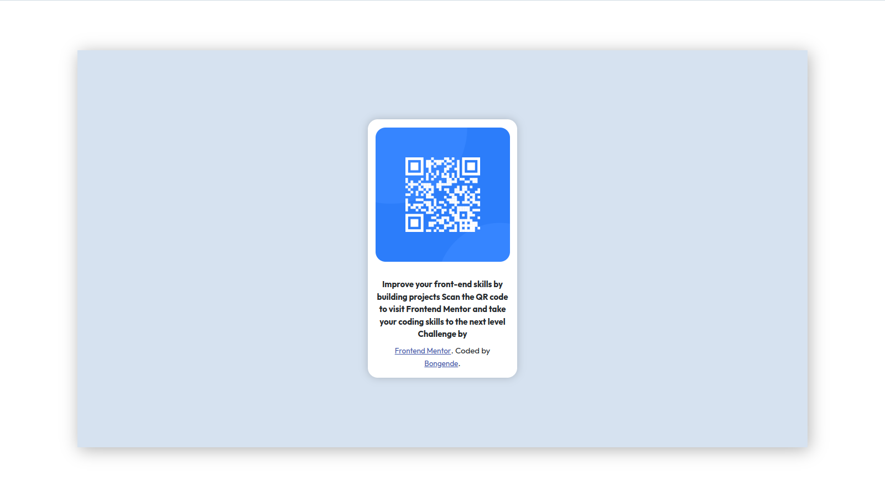

# Frontend Mentor - QR code component solution

This is a solution to the [QR code component challenge on Frontend Mentor](https://www.frontendmentor.io/challenges/qr-code-component-iux_sIO_H). Frontend Mentor challenges help me to improve my coding skills by building realistic projects.

## Table of contents

- [Overview](#overview)
  - [Screenshot](#screenshot)
  - [Links](#links)
- [My process](#my-process)
  - [Built with](#built-with)
  - [What I learned](#what-i-learned)
  - [Continued development](#continued-development)
  - [Useful resources](#useful-resources)
- [Author](#author)
- [Acknowledgments](#acknowledgments)

## Overview

### Screenshot

### Links

- [Solution URL](https://github.com/bongende/Qr-code-component.git)

## My process

### Built with

- Semantic HTML5 markup
- CSS custom properties
- Flexbox
- Bootstrap
- Mobile-first workflow

### What I learned

I remembered more about the basics of CSS flexbox.

### Continued development

In the future, I want to focus more in React and more cool javascript framework for frontend developpement.

### Useful resources

- [W3Scool](https://www.w3schools.com/css/css_align.asp) - This helped me to learn more about CSS layouts.
- [Uniconverter](https://www.unitconverters.net/typography/centimeter-to-pixel-x.htm) - A cool tool to convert measures, it may also help.

## Author

- Linkedin - [Christopher Duwa](www.linkedin.com/in/christopherduwa)
- Frontend Mentor - [@ChristoBongende](https://www.frontendmentor.io/profile/yourusername)
- Twitter - [@0505_Christo](https://www.twitter.com/yourusername)
